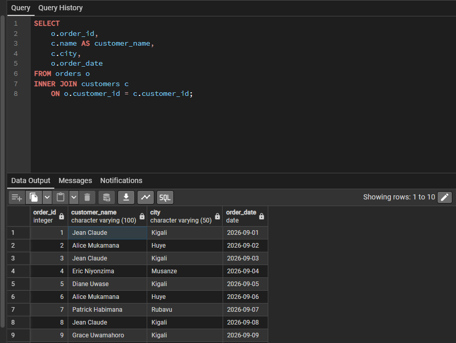

# PLSQL Assignment One - Sunrise Supermarket

## Student Information

- **Name:** Justin MICOMYIZA
- **Student ID:** 29403
- **Group:** B
- **DBMS Used:** PSQL

## Project Summary

This assignment analyzes the customers, products, orders, and sales activities of Sunrise Supermarket using SQL.

The project demonstrates:
- INNER JOIN
- LEFT JOIN
- Common Table Expression (CTE)
- Window functions
- Customer spending analysis
- Order sequence analysis
- Revenue trend analysis

## Business Scenario

Sunrise Supermarket sells products to customers who place orders containing one or more items.

Management wants to understand:
- Who their customers are
- What products customers buy
- How much customers spend
- How frequently customers place orders
- How sales revenue changes over time

The database contains four main tables:

- `customers` - stores customer information.
- `products` - stores product information and prices.
- `orders` - stores customer orders and order dates.
- `order_items` - stores the products and quantities included in each order.

## Database Structure

The database contains:

- 5 customers
- 8 products
- 5 product categories
- 15 orders
- 30 order items
- Orders distributed across multiple dates

## SQL Files

| File | Description |
|---|---|
| `01_create_tables.sql` | Creates the four database tables |
| `02_insert_data.sql` | Inserts customers, products, orders, and order items |
| `03_joins.sql` | Contains the three JOIN queries |
| `04_cte.sql` | Contains the customer spending CTE |
| `05_window_functions.sql` | Contains four window-function queries |

# JOIN Queries

## JOIN 1 - Orders and Customers

### Purpose

List every order with the customer's name, city, and order date.

### SQL

```sql
SELECT
    o.order_id,
    c.customer_name,
    c.city,
    o.order_date
FROM orders o
INNER JOIN customers c
    ON o.customer_id = c.customer_id
ORDER BY o.order_date;
Explanation

The INNER JOIN connects the orders table with the customers table using customer_id.
This allows management to identify the customer and city associated with each order.

Result

The query successfully returned orders together with customer names, cities, and order dates.

Screenshot:



JOIN 2 - Order Items and Products
Purpose
List every order item with the product name, category, price, and quantity.
SQL
SELECT
    oi.order_item_id,
    oi.order_id,
    p.product_name,
    p.category,
    p.price,
    oi.quantity
FROM order_items oi
INNER JOIN products p
    ON oi.product_id = p.product_id
ORDER BY oi.order_id;
Explanation

The INNER JOIN connects order_items with products using product_id.
This shows which products were purchased, their categories, prices, and quantities.

Result

The query successfully displayed the products included in each order together with their prices and quantities.

Screenshot


JOIN 3 - Customers and Orders
Purpose

List all customers and their orders, including customers who have no orders.

SQL

SELECT
    c.customer_id,
    c.customer_name,
    c.city,
    o.order_id,
    o.order_date
FROM customers c
LEFT JOIN orders o
    ON c.customer_id = o.customer_id
ORDER BY c.customer_id, o.order_date;

Explanation
A LEFT JOIN is used so that every customer is included in the result.
If a customer has no order, the order information appears as NULL.

Result

The query successfully displayed customers and their orders while preserving customers without orders.

Screenshot


CTE Query
Customer Spending Above Average
Purpose
Calculate each customer's total spending and return customers whose spending is above the average customer spending.

SQL

WITH customer_totals AS (
    SELECT
        c.customer_id,
        c.customer_name,
        SUM(oi.quantity * p.price) AS total_spend
    FROM customers c
    INNER JOIN orders o
        ON c.customer_id = o.customer_id
    INNER JOIN order_items oi
        ON o.order_id = oi.order_id
    INNER JOIN products p
        ON oi.product_id = p.product_id
    GROUP BY c.customer_id, c.customer_name)
SELECT
    customer_id,
    customer_name,
    total_spend
FROM customer_totals
WHERE total_spend > (
    SELECT AVG(total_spend)
    FROM customer_totals)
ORDER BY total_spend DESC;

Explanation

The CTE named customer_totals first calculates the total amount spent by every customer.
The main query then calculates the average spending and returns only customers whose spending is above that average.
Business Interpretation
This can help Sunrise Supermarket identify customers who contribute more revenue than the average customer.

Result
The query successfully returned customers whose total spending was above the average customer spending.

Screenshot


Window Functions
Window 1 - Customer Spending Rank
Purpose
Rank customers according to their total spending, with the highest spender receiving rank 1.

SQL

SELECT
    c.customer_id,
    c.customer_name,
    SUM(oi.quantity * p.price) AS total_spent,
    RANK() OVER (
        ORDER BY SUM(oi.quantity * p.price) DESC) AS spending_rank
FROM customers c
INNER JOIN orders o
    ON c.customer_id = o.customer_id
INNER JOIN order_items oi
    ON o.order_id = oi.order_id
INNER JOIN products p
    ON oi.product_id = p.product_id
GROUP BY c.customer_id, c.customer_name
ORDER BY spending_rank;

Explanation

The RANK() window function assigns a ranking to customers based on their total spending.
Business Interpretation
Management can use this information to understand customer spending patterns and identify high-value customers.

Screenshot


Window 2 - Customer Order Number
Purpose
Number each customer's orders in chronological order.

SQL

SELECT
    customer_id,
    order_id,
    order_date,
    ROW_NUMBER() OVER (
        PARTITION BY customer_id
        ORDER BY order_date) AS order_number
FROM orders
ORDER BY customer_id, order_date;

Explanation

ROW_NUMBER() gives each order a sequential number for each customer.
PARTITION BY customer_id restarts the numbering for every customer.
Business Interpretation
This helps management understand the sequence of customer purchases and identify repeat customers.

Screenshot


Window 3 - Running Revenue Total
Purpose
Show daily revenue and the running total of revenue over time.

SQL

SELECT
    o.order_date,
    SUM(oi.quantity * p.price) AS daily_revenue,
    SUM(SUM(oi.quantity * p.price)) OVER (
        ORDER BY o.order_date) AS running_total_revenue
FROM orders o
INNER JOIN order_items oi
    ON o.order_id = oi.order_id
INNER JOIN products p
    ON oi.product_id = p.product_id
GROUP BY o.order_date
ORDER BY o.order_date;

Explanation

The query calculates revenue for each order date.
The window function then adds each day's revenue to the previous accumulated revenue to produce a running total.
Business Interpretation
Management can use the running revenue total to monitor sales growth over time.

Screenshot


Window 4 - Days Between Customer Orders
Purpose
For customers with more than one order, calculate the number of days between their current and previous orders.

SQL

SELECT
    customer_id,
    order_id,
    order_date,
    LAG(order_date) OVER (
        PARTITION BY customer_id
        ORDER BY order_date) AS previous_order_date,
    order_date - LAG(order_date) OVER (
        PARTITION BY customer_id
        ORDER BY order_date) AS days_between_orders
FROM orders
WHERE customer_id IN (
    SELECT customer_id
    FROM orders
    GROUP BY customer_id
    HAVING COUNT(*) > 1)
ORDER BY customer_id, order_date;

Explanation

The LAG() function retrieves the previous order date for each customer.
Subtracting the previous date from the current date calculates the number of days between orders.
The query only includes customers who have placed more than one order.
Business Interpretation
This information can help Sunrise Supermarket understand how frequently repeat customers return to make purchases.

Screenshot


Business Interpretation

The SQL analysis provides useful information for Sunrise Supermarket management.

Customer identification: JOIN queries connect customers with their orders and purchasing activities.
Product analysis: Product and order-item information shows which products are included in customer purchases.
Customer spending: The CTE identifies customers whose spending is above the average.
Customer ranking: The first window function ranks customers according to their total spending.
Order frequency: The second window function shows the sequence of each customer's orders.
Revenue tracking: The third window function provides a running total of revenue over time.
Customer retention: The fourth window function shows the number of days between repeat purchases.

These results can support decisions about customer engagement, sales monitoring, and understanding purchasing behavior.

Challenges and Resolutions
Challenge 1 - Understanding JOINs
It was initially challenging to understand how the tables were connected.

Resolution
The relationships between primary keys and foreign keys were reviewed. For example, customer_id connects customers with orders, while product_id connects products with order items.

Challenge 2 - Understanding CTEs
Understanding how a CTE could be used to calculate customer totals before filtering them was challenging.

Resolution
The problem was divided into two steps: first calculating customer totals inside the CTE, then calculating the average and filtering the results in the main query.

Challenge 3 - Understanding Window Functions
Window functions such as RANK(), ROW_NUMBER(), and LAG() required additional practice.

Resolution
Each function was tested separately to understand how partitioning and ordering affect the results.

How to Run the Project
Open Postgres SQL
Run 01_create_tables.sql to create the database tables.
Run 02_insert_data.sql to insert the sample data.
Run 03_joins.sql to execute the JOIN queries.
Run 04_cte.sql to execute the CTE query.
Run 05_window_functions.sql to execute the four window-function queries.
Compare the results with the screenshots included in the assignment.
Conclusion

This assignment demonstrates how SQL can be used to analyze supermarket data.

JOINs were used to combine related tables, a CTE was used to simplify customer spending analysis, and window functions were used to rank customers, number orders, calculate running revenue, and measure the time between repeat purchases.

The analysis provides Sunrise Supermarket with useful information about customers, products, orders, and revenue trends.


